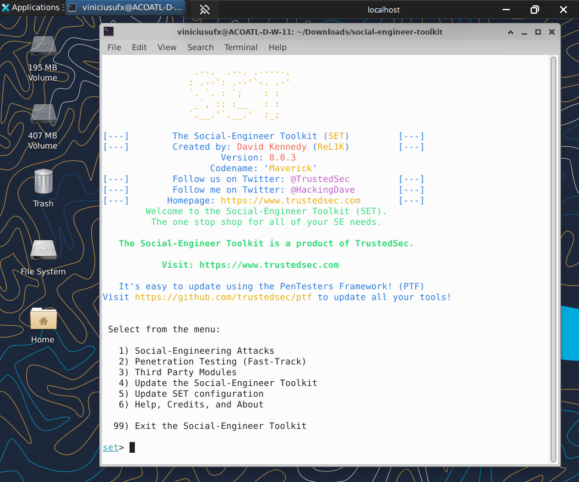

# Phishing para captura de senhas do Facebook

## Ferramentas

- WSL - Ubuntu 24.04 ( "XFCE4 + xrdp" permitindo acesso remoto a maquina com interface grafica completa )
- Conexão de área de Trabalho Remota (Windows)
- Social Engineer Toolkit (setoolkit)


```bash
sudo apt update
sudo apt upgrade
git clone https://github.com/trustedsec/social-engineer-toolkit.git
cd social-engineer-toolkit
sudo apt install python3
sudo apt install python3-pip
sudo apt install python3-pexpect
pip3 install -r requirements.txt
sudo python setup.py
sudo setoolkit
```

```bash
    1) Social-Engering Attacks
    2) Website Attack Vectors
    3) Credential Harvester Attack Method
    2) Site Cloner
    Enter
    http://www.facebook.com/
```
